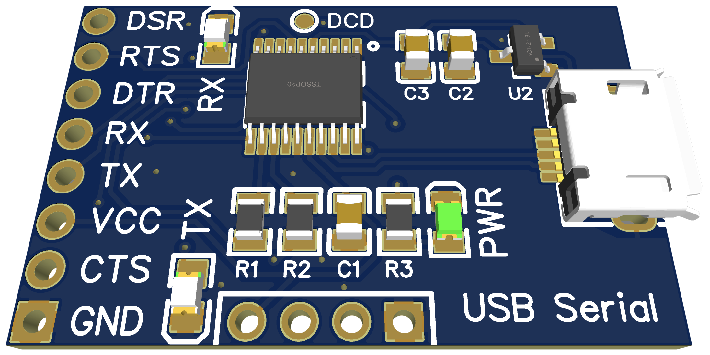
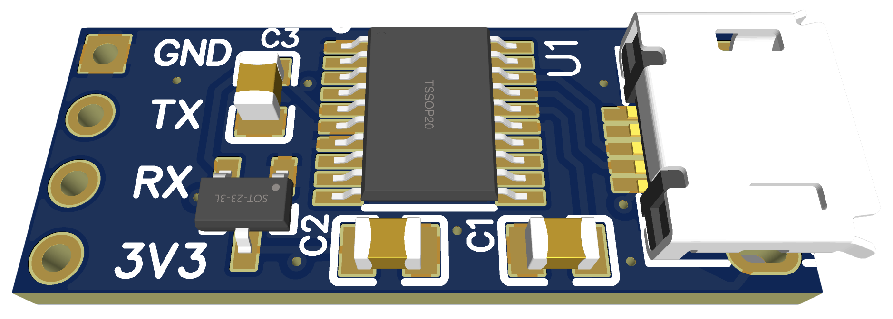

# USB Serial

Open-source hardware and firmware for a USB-to-serial adapter.

## Features

- **No driver installation required** on Windows, Linux and macOS as it implements the USB CDC ACM and PSTN protocols. It will automatically appear as a virtual serial port (virtual COM port).
- **Minimal components needed** as it is built around the STM32F042 MCU that can operate USB without an external crystal.
- **Robust flow control** allowing to operate it at the limit of the selected bit rate.
- Supports hardware flow control (RTS/CTS), bit rates from 1200 to 3,000,000 bps, control of DTR signal, notification of DSR and DCD signals.

## Supported MCUs

The firmware can be built for:

- STM32F042F6 (used on custom hardware)
- STM32F042K6 (found on Nucleo board, used for testing)
- STM32F103C8 (aka as Blue Pill, used for testing)

It shouldn't be too difficult to extend the firmware such that is runs on other STM32 MCUs.

## Flow Control

Flow control ensures that data is only sent as fast as the receiver can accept it. For a USB-to-serial adapter, flow control is most important on the link from the computer to the adapter as USB communication is much faster than serial communication. USB flow control is part of the USB standard and this firmware implements it. It prevents the internal buffer from overflowing and losing data.

In addition, the firmware and hardware implement hardware flow control on the serial port using the RTS and CTS signals. Hardware flow control is always enabled no matter how the virtual port is configured on the computer. It isn't part of the USB CDC protocol to enable or disable it. If you don't want to use hardware flow control, don't connect anything to RTS and CTS. 

## Hardware

There are two hardware versions:

### USB Serial

- board size 28 by 20 mm
- USB micro B connector
- headers for 8 signals (GND, TX, RX, 3.3V, RTS, CTS, DTR, DSR) with easily legible labels
- full SWD headers for programming
- test point for DCD signal
- red power LED
- green LEDs for TX and RX

See more [details](hardware/README.md)

### USB Serial Mini

- board size 25 by 10 mm
- USB micro B connector
- headers for 4 signals (GND, TX, RX, 3.3V) with easily legible labels
- SWD pads on the bottom

See more [details](hardware/README.md)

