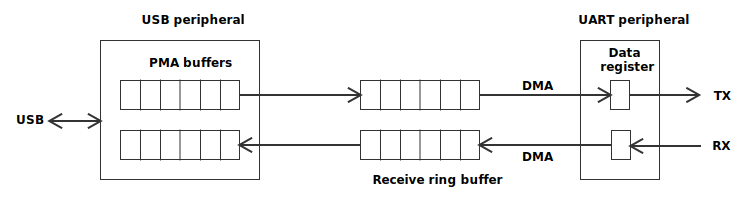

# Firmware Architecture

The firmware takes care of two data paths:

- USB-to-serial path
- serial-to-USB path

The two paths are shown in the figure below. They are mostly independent, both in terms of firmware impelementation and flow control.

## Software Architecture

### USB-to-serial path

When new data has arrived via USB, the callback `usb_serial_impl::on_usb_data_received()` is called. It copies the data from the PMA buffers into the transmit ring buffer and starts the DMA transfer to the UART data register to transmit the data (unless a DMA operation is already in progress).

When the DMA transfer is complete, it updates the ring buffer accordingly and if more data has arrived in the mean-time, another DMA transfer is started.

### Serial-to-USB path

For UART reception, a permanent circular DMA transfer is set up copying received bytes into the receive ring buffer. `usb_serial_impl::poll()` is called very frequently from the loop in `main()`. It reads the DMA transfer state (number of bytes copied by DMA) to check for additional data that has been copied into the ring buffer.

If data has arrived and if no outgoing USB operation is in progress, the data is put into the PMA buffers so it is transmitted when the host polls the device the next time. Once the data has been transmitted, the callback `usb_serial_impl::on_usb_data_transmitted()` is called.

## Flow control

The software implements flow control to regulate the speed of data transfer in order not to overflow the buffers. The speed and speed regulation for USB-to-serial and the serial-to-USB direction are completely independent.

On the UART side, *hardware flow control* using the RTS and CTS signals is implemented. It's always active. If the pins are not connected, transmission works as if there was no flow control.

On the USB side, standard USB flow control is used.

### USB-to-serial path

When the transmission ring buffer is becoming full, the USB *data out* endpoint (data in from the device's perspective) is set to return NAK when the host polls. This indicates that the device is currently unable to accept more data. The threshold for setting NAK is the buffer's *high-water mark*. Once the data in the buffer falls below the high-water mark, NAK is removed.

For the flow control on the UART side, the hardware flow control is enabled in the UART peripheral. So it is fully automatic and no further software actions are needed. If the receiver asserts (pulls low) CTS, the UART will start the transmission of a new byte. When CTS is no longer asserted, transmission continues.

### Serial-to-USB path

To prevent the sender from transmitting more data via the serial connection when the receive buffer is becoming full, the RTS signal is asserted in software in `uart_impl::update_rts()`, which is called frequently from the main loop. It checks the receive buffer fill level. If it exceeds the high-water mark, RTS is asserted (pulled low).

No special flow control is needed on the USB side. The host polls and receives data whenever it is ready. If the host is slow at picking up data, the ring buffer fill level will raise and eventually assert the RTS signal.
